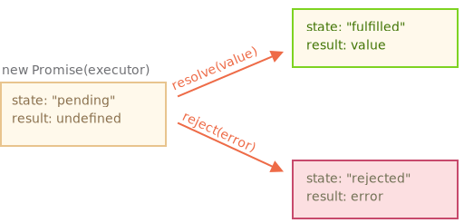
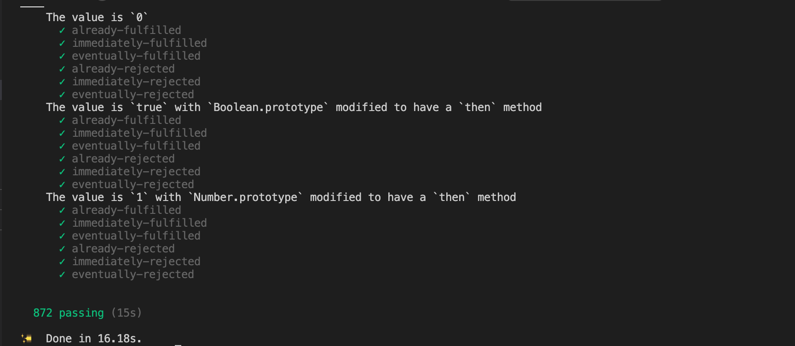

> 写这篇的文章的原因是在公司内部的前端小组里面分享了一下关于Promise的实现。在组内同学一起交流的过程中产生了一些心得，所以在这里分享给大家。


## 什么是Promise 

`Promise`的核心思想是`Promise`表示异步操作的结果。一个`Promise`处于以下三种状态之一：

   * `pending` - `Promise` 的初始化状态
   * `fulfilled` - 表示 `Promise` 成功操作的状态
   * `rejected` - 表示 `Promise` 错误操作的状态
   
`Promise` 的内部状态改变如图所示：





## Promise的出现解决了什么问题

* 1.嵌套地狱的问题

在`Promise`没有出现之前，我们会看到很多类似的代码。
```javascript
const fs = require('fs')

fs.readFile('./data.txt','utf8',function(err,data){
  fs.readFile(data, 'utf8',function(err,data){
    fs.readFile(data,'utf8',function(err,data){
      console.log(data);
    })
  })
})
```

`Promise`出现之后，就可以采用链式调用的形式来写。
```javascript
const fs = require('fs')

const readFile = (filename) => {
  return new Promise((resolve, reject) => {
    fs.readFile(filename, 'utf8', (err, data) => {
      if (err) reject(err);
      resolve(data);
    })
  })
}

readFile('./data.txt').then((data) => {
  return readFile(data) 
}).then((data) => {
  return readFile(data)  
}).then((data) => {
    console.log(data);
})
```

使用了`Promise`之后代码风格变得优雅了很多，写法上也更加直观。

* 2.处理多个异步请求并发

`Promise.all`的出现让我们可以更加方便的处理多个任务完成时在进行处理的逻辑。


## 根据 [Promise/A+](https://promisesaplus.com/) 规范实现 `Promise`

### 基本功能实现

1.在动手写代码之前先了解一下需要实现那些功能。

* `Promise constructor`

> `new Promise` 时，构造函数需要传入一个`executor()` 执行器，`executor`函数会立即执行，并且它支持传入两个参数，分别是 `resolve` 和 `reject`。
>
> ```typescript
> class Promise<T> {
>    constructor(executor: (resolve: (value: T ) => void, reject: >(reason?: any) => void) => void){
>    }
>}
> ```

* `Promise` 状态 「Promise/A+ 2.1」

>`Promise` 必须处于以三种状态之一：
>
>`pending`（等待中），可以转换为 `fulfilled`（完成）或 `rejected`（拒绝）。
>
> 当状态从 `pending` 切换到 `fulfilled` 时，该状态不得再过渡到其它状态，并且必须具有一个值，该值不能更改。
>
> 当状态从 `pending` 切换到 `rejected` 时，该状态不得再过渡到其它状态，并且必须有一个失败的原因，不能更改。


* `Promise then` 方法 「Promise/A+ 2.2」

> `Promise` 必须有一个 `then` 方法，`then` 接收两个参数，分别是成功时的回调 `onFulfilled`, 和失败时的回调 `onRejected`。
>
> `onFulfilled` 和 `onRejected` 是可选的参数，并且如果传入的 `onFulfilled` 和 `onRejected` 不是函数的话，则必须将其忽略。
>
> 如果 `onfulfilled` 是一个函数。则它必须在 `Promise` 的状态变成 `fulfilled`（完成）时才能调用，`Promise` 的值是传进它的第一个参数。并且它只能被调用一次。
>
> 如果 `onRejected` 是一个函数，则它必须在 `Promise` 的状态为 rejected（失败）时调用，并把失败的原因传入它的第一个参数。只能被调用一次。

既然知道了需要实现哪些功能，那就来动手操作一下，代码如下：


```typescript
// 使用枚举定义Promise的状态
enum PROMISE_STATUS {
    PENDING,
    FULFILLED,
    REJECTED
}

class _Promise<T> {
    // 保存当前状态
    private status = PROMISE_STATUS.PENDING
    // 保存resolve的值，或者reject的原因
    private value: T
    constructor(executor: (resolve: (value: T) => void, reject: (reason: any) => void) => void) {
        executor(this._resolve, this._reject)
    }
    
    // 根据规范完成简易功能的then方法
    then(onfulfilled: (value: T) => any, onrejected: (value: any) => any) {
        // 2.2.1
        onfulfilled = typeof onfulfilled === 'function' ? onfulfilled : null;
        onrejected = typeof onrejected === 'function' ? onrejected : null;

        if (this.status === PROMISE_STATUS.FULFILLED) {
            // 状态为fulfilled时调用成功的回调函数
            onfulfilled(this.value)
        }

        if (this.status === PROMISE_STATUS.REJECTED) {
            // 状态为rejected时调用失败的回调函数
            onrejected(this.value)
        }

    }
    
    // 传入executor方法的第一个参数，调用此方法就是成功
    private _resolve = (value) => {
        if (value === this) {
            throw new TypeError('A promise cannot be resolved with itself.');
        }
        // 只有是pending状态才可以更新状态，防止二次调用
        if (this.status !== PROMISE_STATUS.PENDING) return;
        this.status = PROMISE_STATUS.FULFILLED;
        this.value = value;
    }
    
    // 传入executor方法的第二个参数，调用此方法就是失败
    private _reject = (value) => {
        // 只有是pending状态才可以更新状态，防止二次调用
        if (this.status !== PROMISE_STATUS.PENDING) return;
        this.status = PROMISE_STATUS.REJECTED;
        this.value = value
    }

}
```

代码写完了我们测试一下功能：

```
const p1 = new _Promise((resolve, reject) => {
  resolve(2)
})

p1.then(res => {
  console.log(res, 'then ok1')
})

const p2 = new _Promise((resolve, reject) => {
  setTimeout(() => {
    resolve(2)
  }, 1000);
})

p2.then(res => {
  console.log(res, 'then ok2')
})
```

控制台会打印出：

```
2 "then ok1"
```

不错，现在已经是稍见雏形。

### 支持异步操作

我们已经实现了一个入门级的 `Promise`,但是细心的同学应该已经发现了，`then ok2` 这个值没有打印出来。

导致这个问题出现的原因是什么呢？原来是我们在执行then函数的时候，由于是异步操作，状态一直处于pending的状态，传进来的回调函数没有触发执行。

知道了问题就好解决了。只需要把传进来的回调函数存储起来。在调用resolve或reject方法的时候执行就可以了，我们优化一下代码：

```typescript
enum PROMISE_STATUS {
    PENDING,
    FULFILLED,
    REJECTED
}

class _Promise<T> {
    private status = PROMISE_STATUS.PENDING
    private value: T
    // 保存then方法传入的回调函数
    private callbacks = []
    constructor(executor: (resolve: (value: T) => void, reject: (reason: any) => void) => void) {
        executor(this._resolve, this._reject)
    }

    then(onfulfilled: (value: T) => any, onrejected: (value: any) => any) {
        // 2.2.1
        onfulfilled = typeof onfulfilled === 'function' ? onfulfilled : null;
        onrejected = typeof onrejected === 'function' ? onrejected : null;

        // 把then方法传入的回调函数整合一下
        const handle = () => {
            if (this.status === PROMISE_STATUS.FULFILLED) {
                onfulfilled && onfulfilled(this.value)
            }

            if (this.status === PROMISE_STATUS.REJECTED) {
                onrejected && onrejected(this.value)
            }
        }

        if (this.status === PROMISE_STATUS.PENDING) {
            // 当状态是pending时，把回调函数保存进callback里面
            this.callbacks.push(handle)
        }

        handle()
    }

    private _resolve = (value) => {
        if (value === this) {
            throw new TypeError('A promise cannot be resolved with itself.');
        }
        if (this.status !== PROMISE_STATUS.PENDING) return;
        this.status = PROMISE_STATUS.FULFILLED;
        this.value = value;
        // 遍历执行回调
        this.callbacks.forEach(fn => fn())
    }

    private _reject = (value) => {
        if (this.status !== PROMISE_STATUS.PENDING) return;
        this.status = PROMISE_STATUS.REJECTED;
        this.value = value
        // 遍历执行回调
        this.callbacks.forEach(fn => fn())
    }


}

```

在来测试一下上面的代码：

```
const p2 = new _Promise((resolve, reject) => {
  setTimeout(() => {
    resolve(2)
  }, 1000);
})

p2.then(res => {
  console.log(res, 'then ok2')
})
```

在等待1s后，控制台会打印出：
```
2 "then ok2"
```

目前已经可以支持异步操作了。现在的你已经是江湖中的高手了。


### then 方法的链式调用

在文章一开头介绍Promise时，提到了链式调用的概念`.then().then()`，现在就要实现这个至关重要的功能，在开始前先看一下`Promise/A+`的规范

> `then`必须返回一个Promise 「Promise/A+ 2.2.7」
>
> ```promise2 = promise1.then(onFulfilled, onRejected);```
>
> 如果一个 `onFulfilled` 或 `onRejected` 返回一个值 `x` ,则运行 `Promise Resolution Procedure` (会在下面实现这个方法)。
>
> 如果任何一个 `onFulfilled `或 `onRejected` 引发异常 `e` 则 `promise2` 必须以 `e` 为其理由 `reject` (拒绝).
>
> 如果 `onFulfilled` 不是函数且`promise1`状态已经`fuifilled`（完成），则 `promise2` 必须使用与相同的值来实现 `promise1`。
>
> 如果`onRejected`不是函数而 `promise1` 状态为`rejected`（拒绝），则 `promise2` 必须以与相同的理由将其拒绝 `promise1`。
> ### Promise Resolution Procedure 实现
> 
> 首先该方法的使用方式类似于下面这种形式
> ```resolvePromise(promise,x,...)```
>
> 如果 `promise` 和 `x` 引用相同的对象，promise 则应该以TypeError为理由拒绝。「Promise/A+ 2.3.1」
>
> 如果 `x` 是一个 `promise` ，则应该采用它原本的状态返回。「Promise/A+ 2.3.2」
>
> 否则，判断 `x` 如果是对象或者是函数。则执行以下操作，先声明 `let then = x.then` ,如果出现异常结果 `e` ,则以 `e` 作为 `promise` reject（拒绝）的原因。如果 `then` 是个函数，则用 `call` 执行 `then` ，把 `this` 指向为 `x` ，第一个参数用 `resolvePromise` 调用，第二个用 `rejectPromise` 调用「Promise/A+ 2.3.3」
>
> 如果 `x` 不是对象或者方法，则使用 `x` 的值 `resolve` 完成 「Promise/A+ 2.3.4」

只是通过文字不太容易理解，我们来看一下代码的实现：

```typescript
enum PROMISE_STATUS {
    PENDING,
    FULFILLED,
    REJECTED
}

class _Promise<T> {
    private status = PROMISE_STATUS.PENDING
    private value: T
    private callbacks = []
    constructor(executor: (resolve: (value: T) => void, reject: (reason: any) => void) => void) {
        executor(this._resolve, this._reject)
    }

    then(onfulfilled: (value: T) => any, onrejected: (value: any) => any) {
        // 2.2.1
        onfulfilled = typeof onfulfilled === 'function' ? onfulfilled : null;
        onrejected = typeof onrejected === 'function' ? onrejected : null;

        const nextPromise = new _Promise((nextResolve, nextReject) => {
            const handle = () => {
                if (this.status === PROMISE_STATUS.FULFILLED) {
                    const x = (onfulfilled && onfulfilled(this.value))
                    this._resolvePromise(nextPromise, x, nextResolve, nextReject)
                }

                if (this.status === PROMISE_STATUS.REJECTED) {
                    if (onrejected) {
                        const x = onrejected(this.value)
                        this._resolvePromise(nextPromise, x, nextResolve, nextReject)
                    } else {
                        nextReject(this.value)
                    }
                }

            }
            if (this.status === PROMISE_STATUS.PENDING) {
                this.callbacks.push(handle)
            } else {
                handle()
            }

        });
        return nextPromise

    }

    private _resolve = (value) => {
        if (value === this) {
            throw new TypeError('A promise cannot be resolved with itself.');
        }
        if (this.status !== PROMISE_STATUS.PENDING) return;
        this.status = PROMISE_STATUS.FULFILLED;
        this.value = value;
        this.callbacks.forEach(fn => fn())
    }

    private _reject = (value) => {
        if (this.status !== PROMISE_STATUS.PENDING) return;
        this.status = PROMISE_STATUS.REJECTED;
        this.value = value
        this.callbacks.forEach(fn => fn())
    }

    private _resolvePromise = <T>(nextPromise: _Promise<T>, x: any, resolve, reject) => {

        // 2.3.1 nextPromise 不能和 x 相等
        if (nextPromise === x) {
            return reject(new TypeError('The promise and the return value are the same'));
        }

        // 2.3.2 如果 x 是 Promise 返回 x 的状态和值
        if (x instanceof _Promise) {
            x.then(resolve, reject)
        }

        // 2.3.3 如果 x 是对象或者函数执行 if 里面的逻辑
        if (typeof x === 'object' || typeof x === 'function') {
            if (x === null) {
                return resolve(x);
            }

            // 2.3.3.1
            let then;
            try {
                then = x.then;
            } catch (error) {
                return reject(error);
            }

            // 2.3.3.3
            if (typeof then === 'function') {
                // 声明called 在调用过一次resolve或者reject之后，修改为true，保证只能调用一次
                let called = false; 
                try {
                    then.call(x, y => {
                        if (called) return; // 2.3.3.3.4.1
                        called = true;
                        // 递归解析的过程（因为可能 promise 中还有 promise）
                        this._resolvePromise(nextPromise, y, resolve, reject) 
                    }, r => {
                        if (called) return; // 2.3.3.3.4.1
                        called = true;
                        reject(r)
                    })
                } catch (e) {
                    if (called) return; // 2.3.3.3.4.1
                    // 2.3.3.3.4
                    reject(e)
                }
            } else {
                // 2.3.3.4
                resolve(x)
            }
        } else {
            // 2.3.4
            resolve(x);
        }

    }

}

```

目前已经实现可以链式调用的功能了，我们来测试一下：

```
const p3 = new _Promise((resolve, reject) => {
    setTimeout(() => {
        resolve(3)
    }, 1000);
})

p3.then(res => {
  console.log(res, 'then ok3')
  return '链式调用'
}).then(res => {
  console.log(res)
})
```

等待1s之后，控制台会打印出：

```
3 "then ok3"
"链式调用"
```

### 支持微任务

有没有同学想到还缺少了一个尤为重要的功能，那就是微任务。我们应该如何实现和内置 `Promise` 一样的微任务流程呢?

在 `Web Api` 里面有这样一个方法 [MutationObserver](https://developer.mozilla.org/zh-CN/docs/Web/API/MutationObserver)。我们可以基于它实现微任务的功能。并且也已经有相关的库给我们封装好了这个方法，它就是 [asap](https://github.com/kriskowal/asap)。只要把需要以微任务执行的函数传入即可。

```javascript
asap(function () {
    // ...
});
```

其实在 `Web Api` 里面还有这样一个方法 [queueMicrotask](https://developer.mozilla.org/zh-CN/docs/Web/API/WindowOrWorkerGlobalScope/queueMicrotask) 可以直接使用。使用方式也是把要以微任务执行的函数传入进去即可。

```javascript
self.queueMicrotask(() => {
  // 函数的内容
})
```

`queueMicrotask` 唯一的缺点就是兼容性不太好，在生产环境中建议还是使用 `asap` 这个库来实现微任务。

把之前写好的 `Promise then` 方法稍微做一下调整：

```typescript
    then(onfulfilled: (value: T) => any, onrejected: (value: any) => any) {
        // 2.2.1
        onfulfilled = typeof onfulfilled === 'function' ? onfulfilled : null;
        onrejected = typeof onrejected === 'function' ? onrejected : null;

        const nextPromise = new _Promise((nextResolve, nextReject) => {
            const _handle = () => {
                if (this.status === PROMISE_STATUS.FULFILLED) {
                    const x = (onfulfilled && onfulfilled(this.value))
                    this._resolvePromise(nextPromise, x, nextResolve, nextReject)
                }

                if (this.status === PROMISE_STATUS.REJECTED) {
                    if (onrejected) {
                        const x = onrejected(this.value)
                        this._resolvePromise(nextPromise, x, nextResolve, nextReject)
                    } else {
                        nextReject(this.value)
                    }
                }

            }
            const handle = () => {
                // 支持微任务
                queueMicrotask(_handle)
            }
            if (this.status === PROMISE_STATUS.PENDING) {
                this.callbacks.push(handle)
            } else {
                handle()
            }

        });
        return nextPromise

    }
```

现在完美支持微任务，和内置 `Promises` 事件执行顺序一致。我们来测试一下：

```javascript
console.log('first')
const p1 = new _Promise(function (resolve) {
  console.log('second')
  resolve('third')
})
p1.then(console.log)
console.log('fourth')
```

可以看到控制台打印的结果为：

```typescript
first
second
fourth
third
```

到这里，我们已经把Promise最关键的功能完成了：`支持异步操作`，`then支持链式调用`，`支持微任务`。

## 测试完成的 Promise 是否符合规范

1.下载Promise/A+规范提供了一个专门的测试脚本 `promises-aplus-tests`
```
yarn add promises-aplus-tests -D
```
2.在我们的代码中加入以下代码：
```typescript
(_Promise as any).deferred = function () {
    let dfd = {} as any;
    dfd.promise = new Promise((resolve, reject) => {
        dfd.resolve = resolve;
        dfd.reject = reject;
    });
    return dfd;
}

module.exports = _Promise;
```

3.修改 `package.json` 文件增加以下内容（`./dist/promise/index.js`是需要测试的文件路径）：

```
{
  "scripts": {
    "test": "promises-aplus-tests ./dist/promise/index.js"
  }
}
```

4.执行 `yarn test`




可以看到872个测试用例全部通过。

## `Promise` 的其它 `API` 实现

到目前为止，上述代码已经完整的按照 Promise/A+ 规范实现了，但还有一些内置Api没有实现。下面就把这些内置的方法来实现：

```typescript
class _Promise {

    catch(onrejected) {
        return this.then(null, onrejected)
    }

    finally(cb) {
        return this.then(
            value => _Promise.resolve(cb()).then(() => value),
            reason => _Promise.resolve(cb()).then(() => { throw reason })
        );
    }

    static resolve(value) {
        if (value instanceof _Promise) {
            return value;
        }

        return new _Promise(resolve => {
            resolve(value);
        });
    }

    static reject(reason) {
        return new _Promise((resolve, reject) => {
            reject(reason);
        });
    }

    static race(promises) {
        return new _Promise(function (resolve, reject) {
            if (!Array.isArray(promises)) {
                return reject(new TypeError('Promise.race accepts an array'));
            }
            for (var i = 0, len = promises.length; i < len; i++) {
                _Promise.resolve(promises[i]).then(resolve, reject);
            }
        });

    }

    static all(promises) {
        let result = [];
        let i = 0;

        return new _Promise((resolve, reject) => {
            const processValue = (index, value) => {
                result[index] = value;
                i++;
                if (i == promises.length) {
                    resolve(result);
                };
            };
            for (let index = 0; index < promises.length; index++) {
                promises[index].then(value => {
                    processValue(index, value);
                }, reject);
            };
        });
    }

    static allSettled(promises) {
        let result = []
        let i = 0;
        return new _Promise((resolve, reject) => {
            const processValue = (index, value, status: 'fulfilled' | 'rejected') => {
                result[index] = { status, value }
                i++;
                if (i == promises.length) {
                    resolve(result);
                };
            };


            for (let index = 0; index < promises.length; index++) {
                promises[index].then(value => {
                    processValue(index, value, 'fulfilled')
                }, value => {
                    processValue(index, value, 'rejected')
                });
            };
        })
    }
    
    ...
}
```

## 如何实现 `async` 和 `await`

我们完成了 `Promise` 的实现。但是大家有没有想过 `async` 和 `await` 这个 `Promise` 的语法糖如何实现呢？

这里我们就要借助 `Generator` 函数来实现这个功能，废话少说，直接上代码：

```javascript
let gp1 = new _Promise(r => {
    setTimeout(() => {
        r(1)
    }, 1000);
})

let gp2 = new _Promise(r => {
    setTimeout(() => {
        r(2)
    }, 1000);
})

function* gen() {
    let a = yield gp1
    let b = yield gp2
    return b + a
}

function run(gen) {
    return new _Promise(function (resolve, reject) {
        g = gen()
        function next(v) {
          ret = g.next(v)
          if (ret.done) return resolve(ret.value);
          _Promise.resolve(ret.value).then(next)
        }
        next()
    })
}

run(gen).then(console.log)
```

控制台里面会打印出结果为：`3`

如果对这个 `run` 函数感兴趣，推荐去看下这个 [co](https://github.com/tj/co) 库实现,代码写的非常简洁，只有一百行左右，值的一看。

## 总结

用了近半天的时间才把这篇文章给写出来。不想手敲一遍的同学可以直接拉下来代码执行查看结果。